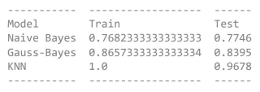

# number-recognition
Number recognition with computer vision using Naive Bayes, Gauss-Bayes and KNN.

#Abstract

###Miguel Solis

Google human workers are able to manually register house numbers with an accuracy of 98%. The goal of this project is to reach at least 98% accuracy for number recognition with one of these machine learning models:
*Naive Bayes
*Gauss-Bayes
*KNN

The results were as follows:

Min - Max normalization were required. The results were as follows:

The 98% accuracy could not be met. Other models may be needed to reach the required accuracy. 
